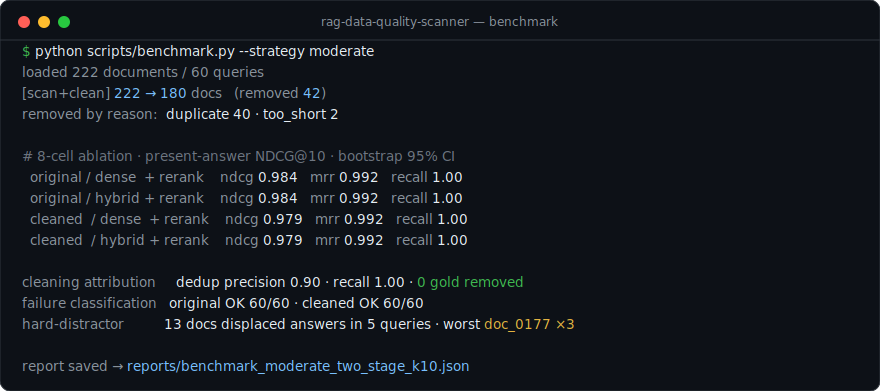
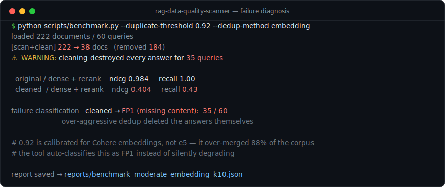
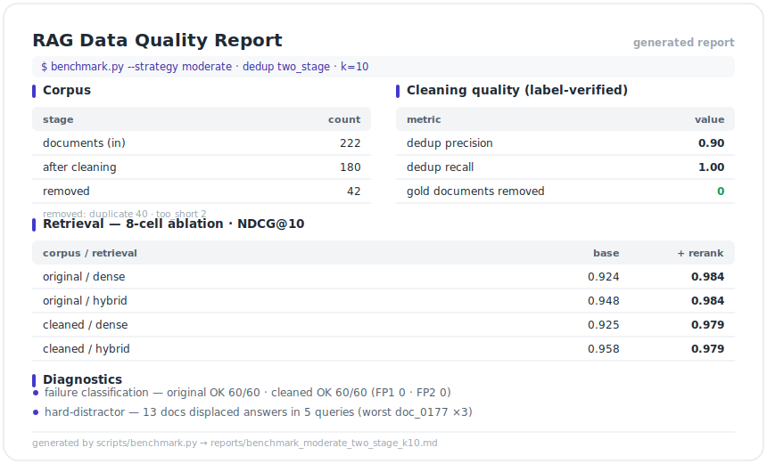

# RAG Data Quality Scanner

**[English](README.md)** | 한국어

**RAG 검색 정확도를 떨어뜨리는 데이터 품질 문제를 탐지·정량화·수리하는 진단 도구**

[](https://python.org)
[](tests/)
[](#설치--실행)

RAG 성능 저하의 주범은 모델이 아니라 **데이터**인 경우가 많습니다 — 중복 문서가
검색 결과를 오염시키고, "정답처럼 보이지만 정답이 없는" 문서가 진짜 답을 밀어내며,
과도한 클리닝은 정답 자체를 삭제합니다. 이 도구는 그 각각을 **측정 가능한 문제**로
만들어 진단하고, 수리 전후를 공정한 벤치마크로 검증합니다.

모든 설계 결정은 RAG 실패 연구에 근거합니다 —
[Barnett et al. (CAIN 2024)](https://arxiv.org/abs/2401.05856)의 7가지 실패 지점,
[Cuconasu et al. (SIGIR 2024)](https://arxiv.org/abs/2401.14887)의 문서 분류 체계.
원문 검증 내역은 [docs/RESEARCH_NOTES.md](docs/RESEARCH_NOTES.md) 참고.

---

## 핵심 기능

| 기능 | 설명 | 근거 연구 |
|------|------|----------|
| **2단계 중복 탐지** | MinHash/LSH 어휘 후보 → 임베딩 코사인 검증. O(n) 확장 + 템플릿 코퍼스 과병합 방지 | 표준 dedup 관행 |
| **모델 보정 임계값** | 임베딩 모델별 유사도 스케일에 맞춘 중복 임계값 (e5: 0.985, Cohere: 0.92) | 자체 측정 (아래 '발견' 참조) |
| **Hard-distractor 분석** | 정답을 top-k 밖으로 밀어내는 문서를 쿼리 단위로 귀속 추적 | Power of Noise (SIGIR'24) |
| **실패 유형 자동 분류** | 쿼리별 실패를 FP1(정답 부재)/FP2(랭킹 실패)로 분류 — 과도한 클리닝이 정답을 파괴하면 즉시 드러남 | Seven Failure Points (CAIN'24) |
| **하이브리드 검색** | BM25(한국어 바이그램 토크나이저) + dense를 RRF로 융합 | 하이브리드 검색 연구 |
| **공정한 벤치마크** | {원본, 클리닝} × {dense, hybrid} × {±rerank} 8셀 ablation + 부트스트랩 95% CI | 자체 방법론 |
| **라벨 기반 클리닝 검증** | 제거한 문서가 진짜 중복이었는지 정밀도/재현율로 측정 | 통제 평가셋 |

## 검증된 결과 (통제 평가셋: 222문서 / 60쿼리, 로컬 e5 임베딩)

| 항목 | 수치 |
|------|------|
| 중복 제거 정밀도 / 재현율 | **0.90 / 1.00** (gold 원본 오삭제 0건) |
| 클리닝 후 NDCG@10 | 0.936 (원본 0.927 — 문서 19% 감축에도 유지·개선) |
| 리랭킹 효과 | **+0.06 NDCG** (최대 단일 효과, 모든 팔에서 일관) |
| 하이브리드 효과 (코드 조회 쿼리) | dense 0.904 → **hybrid 0.994** |
| 실패 진단 데모 | 잘못된 임계값(0.92) 사용 시 **"정답 파괴된 쿼리 35/60개"를 FP1으로 자동 검출** |

> 평가셋은 [Power of Noise의 문서 분류](docs/RESEARCH_NOTES.md)(gold/relevant/related/
> irrelevant + 중복·저품질 결함)를 라벨로 갖는 통제 합성 코퍼스입니다. 문서마다
> 정답 클래스를 알기 때문에 "무엇이 검색을 해쳤는지" 귀속 분석이 가능합니다 —
> 실제 스크랩 코퍼스로는 불가능한 검증입니다. (`scripts/generate_eval_dataset.py`)

---

## 이 프로젝트를 만들며 발견한 것들

측정 도구를 만들자 도구 자신의 결함이 드러났습니다. 전부 재현 가능한 실험과 함께
수정됐습니다:

1. **임베딩 유사도 스케일은 모델 간 이식이 안 된다.** Cohere 기준 중복 임계값
   0.92를 e5에 그대로 쓰면 무관한 문서(코사인 ~0.80)까지 휩쓸려 222문서 중
   196개가 "중복"으로 삭제된다 (hit rate 1.0 → 0.17). 측정 결과 e5의 진짜 중복
   경계는 ~0.985. → 임베딩 프로바이더가 자기 모델에 보정된 권장 임계값을 제공하는
   구조로 변경.
2. **"긴 문서를 대표로 유지"는 위험하다.** 교란된 사본은 접두어·공백 때문에
   원본보다 길어서, 이 규칙은 깨끗한 원본 15개를 지우고 오염된 사본을 남겼다.
   → 타이포그래피 청결도 우선 선택으로 교체.
3. **평면 NDCG는 중복 제거를 벌준다.** 중복 사본이 GT에 있으면 제거 후 "정답
   미회수"로 부당 감점(0.93 → 0.78처럼 보임). → 코퍼스별 존재-정답 평가 +
   사실(fact) 단위 recall 도입.
4. **표준 NDCG 구현 오류.** 이전 구현은 검색된 목록 안에서만 정규화해 정답 3개 중
   1개만 찾아도 1.0이 나왔다 — 기존 "+183% 개선" 주장이 부풀려진 원인. → 표준
   정의(전체 정답 기준 IDCG)로 교체, 테스트로 고정.

## 설치 · 실행

**API 키 없이 동작합니다.** 기본 백엔드는 sentence-transformers(다국어 e5) +
인메모리 벡터 검색 — 클론 후 바로 실행됩니다.

```bash
git clone https://github.com/chaeminyoon/rag-data-quality-scanner.git
cd rag-data-quality-scanner
pip install -r requirements.txt
cp .env.example .env          # 기본값(local 백엔드) 그대로 사용 가능

# Streamlit UI
python -m streamlit run src/main.py

# 또는 CLI 벤치마크 (통제 평가셋 생성 → 8셀 ablation)
python scripts/generate_eval_dataset.py
python scripts/benchmark.py --strategy moderate
```

Cohere/Pinecone을 쓰려면 `.env`에서 `EMBEDDING_BACKEND=cohere`,
`VECTOR_BACKEND=pinecone`과 API 키를 설정하면 됩니다 (선택 사항).

### 재앙 시나리오 재현 (실패 진단 데모)

```bash
# 잘못 보정된 임계값으로 클리닝 → FP1(정답 파괴) 자동 검출을 확인
python scripts/benchmark.py --duplicate-threshold 0.92 --dedup-method embedding
# 출력: 경고: 클리닝으로 정답이 전부 삭제된 쿼리 35개
#       실패 분류[cleaned]: {'fp1_missing_content': [...35개...]}
```

## 아키텍처

```
문서 (CSV / PDF)
   │
   ▼
[1] Ingest    ─── 로드 + 문장 청킹 → 문서
   │
   ▼
[2] Scan      ─── 임베딩 · 2단계 dedup (MinHash → 코사인) · 품질 분석
   │
   ▼
[3] Clean     ─── 중복 / 노이즈 제거, 정답은 보존
   │
   ▼
[4] Index     ─── 벡터 스토어 + BM25
   │
   ▼
[5] Retrieve  ─── dense · bm25 · hybrid (RRF)   ·   선택적 cross-encoder rerank
   │
   ▼
[6] Evaluate  ─── 8-cell ablation · NDCG / MRR / recall · 부트스트랩 95% CI
   │
   ▼
[7] Diagnose  ─── 실패 분류 (FP1 / FP2) · hard-distractor 분석
   │
   ▼
리포트 (Markdown)
```

**교체 가능한 백엔드** — `scan · index · retrieve · rerank`는 공통 인터페이스로 백엔드를 결정합니다: **local**(기본값, 완전 오프라인 · API 키 불필요) 또는 **cohere / pinecone**(선택). `EmbeddingProvider`, `VectorStore`, `BaseReranker` 참고.

## CLI 실행 화면

한 번의 명령으로 스캔·클리닝·8-cell ablation 실행 후 라벨 기반 진단(dedup 정밀도/재현율,
실패 분류, hard-distractor)까지 출력합니다 (API 키 불필요, 노트북 CPU 기준 약 40초):



일부러 잘못된 중복 임계값을 주면 조용히 성능이 무너지는 대신, 도구가 그 피해를
**FP1(정답 부재)로 자동 분류**하고 60개 쿼리 중 35개가 정답을 전부 잃었다고 알려줍니다:



매 실행마다 공유 가능한 Markdown 리포트(`reports/*.md`)도 생성됩니다 — 코퍼스 요약,
라벨 기반 클리닝 품질, 8-cell ablation 전체, 진단 결과:



## 프로젝트 구조

```
rag-data-quality-scanner/
├── src/
│   ├── main.py                  # Streamlit 앱
│   ├── embeddings/              # EmbeddingProvider: local(e5) | cohere
│   ├── vectordb/                # VectorStore: local(numpy) | pinecone
│   ├── retrieval/               # BM25(한국어 바이그램) + RRF 하이브리드
│   ├── scanner/
│   │   ├── scanner.py           # 스캔 오케스트레이터
│   │   ├── noise_detector.py    # 중복 탐지 (embedding | two_stage)
│   │   ├── minhash_dedup.py     # MinHash/LSH 후보 생성
│   │   ├── distractor_analyzer.py  # hard-distractor + FP1/FP2 분류
│   │   ├── text_analyzer.py     # 텍스트 품질 (6개 이슈 타입)
│   │   └── cleaner.py           # 클리닝 전략 (3단계)
│   ├── evaluator/               # 지표(표준 NDCG/MRR/...), 리랭커, 비교 평가
│   ├── evalgen/                 # 통제 평가셋 생성기 (문서 클래스 라벨)
│   └── ingest/                  # CSV/PDF 파서, 청커
├── scripts/
│   ├── generate_eval_dataset.py # 평가셋 생성 CLI
│   └── benchmark.py             # 8셀 ablation 벤치마크 CLI
├── tests/                       # 76 tests
├── docs/RESEARCH_NOTES.md       # 근거 연구 원문 검증 노트
└── data/eval/                   # 생성된 평가셋 (222 docs / 60 queries)
```

## 한계와 다음 단계

- 평가셋은 **통제 합성** 코퍼스다 — 귀속 분석이 가능한 대신 실제 코퍼스의 잡음
  다양성을 다 담지 못한다. 실데이터 검증이 다음 단계.
- distractor 분석은 GT 쿼리가 있어야 동작한다. GT 없는 코퍼스용 근사 방법(쿼리
  합성) 미구현.
- 청크 크기 스윕 벤치마크는 장문 코퍼스가 필요해 보류 (현 평가셋은 단문).
- Streamlit UI에 distractor/실패 분류 뷰 미노출 (CLI 리포트에만 포함).

## 근거 연구

- Barnett et al., *Seven Failure Points When Engineering a RAG System*, CAIN 2024 — [arXiv:2401.05856](https://arxiv.org/abs/2401.05856)
- Cuconasu et al., *The Power of Noise: Redefining Retrieval for RAG Systems*, SIGIR 2024 — [arXiv:2401.14887](https://arxiv.org/abs/2401.14887)
- 세부 검증·인용: [docs/RESEARCH_NOTES.md](docs/RESEARCH_NOTES.md)
