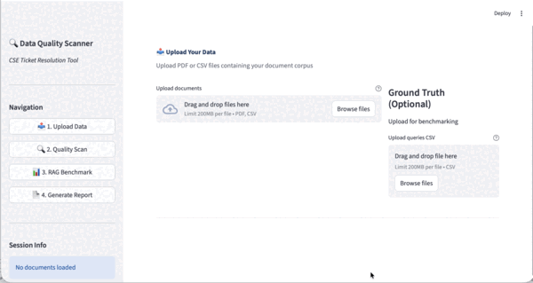
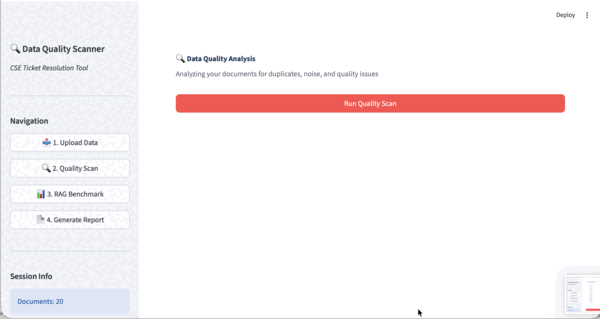
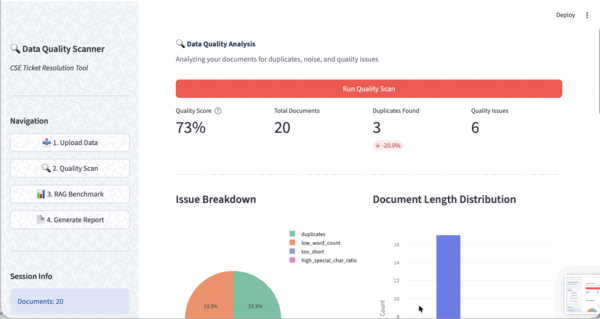
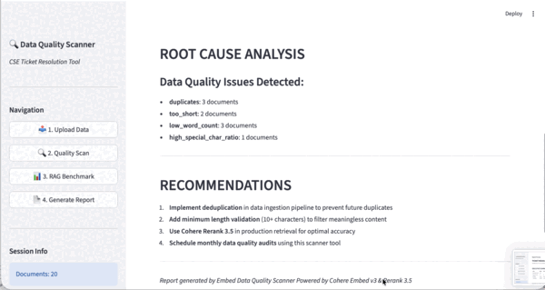

<p align="center">
  <a href="README.md">English</a> | <a href="README.ko.md">한국어</a>
</p>
<h1 align="center">RAG Data Quality Scanner</h1>

<p align="center">A diagnostic tool that detects, quantifies, and repairs the data-quality issues that degrade RAG retrieval accuracy</p>

<p align="center">
  
  
  
[](#install--run)
</p>

The main culprit behind degraded RAG performance is often the **data**, not the
model — duplicate documents contaminate retrieval results, documents that *look*
like answers but contain none push the real answers out of the top-k, and
over-aggressive cleaning deletes the answers themselves. This tool turns each of
those into a **measurable problem**, diagnoses it, and verifies every repair
with a fair before/after benchmark.

Every design decision is grounded in RAG failure research —
the seven failure points of [Barnett et al. (CAIN 2024)](https://arxiv.org/abs/2401.05856)
and the document taxonomy of [Cuconasu et al. (SIGIR 2024)](https://arxiv.org/abs/2401.14887).
Primary-source verification notes: [docs/RESEARCH_NOTES.md](docs/RESEARCH_NOTES.md).

---

## Key Features

| Feature | Description | Grounding |
|---------|-------------|-----------|
| **Two-stage deduplication** | MinHash/LSH lexical candidates → embedding-cosine verification. ~O(n) scaling + refuses to over-merge template-heavy corpora | Standard dedup practice |
| **Model-calibrated thresholds** | Duplicate thresholds matched to each embedding model's similarity scale (e5: 0.985, Cohere: 0.92) | Own measurements (see Findings) |
| **Hard-distractor analysis** | Attributes, per query, which documents push answers out of the top-k | Power of Noise (SIGIR'24) |
| **Automatic failure classification** | Classifies per-query failures as FP1 (missing content) / FP2 (missed top-ranked) — over-cleaning that destroys answers becomes immediately visible | Seven Failure Points (CAIN'24) |
| **Hybrid retrieval** | BM25 (Korean bigram tokenizer) + dense, fused with RRF | Hybrid search literature |
| **Fair benchmarking** | 8-cell ablation {original, cleaned} × {dense, hybrid} × {±rerank} with bootstrap 95% CIs | Own methodology |
| **Label-verified cleaning** | Measures whether removed documents were *actually* duplicates (precision/recall) | Controlled eval set |

## Verified Results (controlled eval set: 222 docs / 60 queries, local e5 embeddings)

| Item | Result |
|------|--------|
| Dedup precision / recall | **0.90 / 1.00** (zero gold originals deleted) |
| NDCG@10 after cleaning | 0.936 (original 0.927 — maintained/improved with 19% fewer docs) |
| Reranking effect | **+0.06 NDCG** (largest single lift, consistent across all arms) |
| Hybrid effect (code-lookup queries) | dense 0.904 → **hybrid 0.994** |
| Failure-diagnosis demo | With a miscalibrated threshold (0.92), the tool auto-detects **"answers destroyed for 35/60 queries" as FP1** |

> The eval set is a controlled synthetic corpus whose documents carry class
> labels from the [Power of Noise taxonomy](docs/RESEARCH_NOTES.md)
> (gold/relevant/related/irrelevant + duplicate/low-quality defects). Because
> every document's answer-bearing status is known, retrieval failures can be
> **attributed to specific data-quality causes** — something a real scraped
> corpus cannot offer. (`scripts/generate_eval_dataset.py`)

---

## Findings from Building This

Building the measurement tool exposed the tool's own defects. All fixed, with
reproducible experiments:

1. **Embedding similarity scales are not portable across models.** Applying
   the Cohere-calibrated duplicate threshold (0.92) to e5 sweeps up even
   unrelated documents (cosine ≈ 0.80): 196 of 222 documents got deleted as
   "duplicates" (hit rate 1.0 → 0.17). Measured, e5's true duplicate boundary
   is ≈ 0.985. → Embedding providers now expose a model-calibrated
   recommended threshold.
2. **"Keep the longest document" is dangerous.** A perturbed copy is often
   *longer* than the clean original (added prefixes/whitespace), so this rule
   deleted 15 clean originals in favor of corrupted copies. → Replaced with
   cleanest-copy selection (fewest typographic artifacts).
3. **Flat NDCG punishes deduplication.** If duplicate copies sit in the ground
   truth, removing them counts as "answers not retrieved" (looks like
   0.93 → 0.78). → Added present-answer evaluation + fact-level recall.
4. **A standard NDCG implementation bug.** The previous version normalized
   only within the retrieved list, so retrieving 1 of 3 relevant docs at rank
   1 scored a perfect 1.0 — the source of the repo's former inflated "+183%"
   claim. → Replaced with the standard definition (IDCG over the full
   relevant set), locked in by tests.

## Install · Run

**No API keys required.** The default backend is sentence-transformers
(multilingual e5) + an in-memory vector store — clone and run.

```bash
git clone https://github.com/chaeminyoon/rag-data-quality-scanner.git
cd rag-data-quality-scanner
pip install -r requirements.txt
cp .env.example .env          # defaults (local backend) work as-is

# Streamlit UI
python -m streamlit run src/main.py

# Or the CLI benchmark (generate the controlled eval set → 8-cell ablation)
python scripts/generate_eval_dataset.py
python scripts/benchmark.py --strategy moderate
```

To use Cohere/Pinecone instead, set `EMBEDDING_BACKEND=cohere`,
`VECTOR_BACKEND=pinecone` and the API keys in `.env` (optional).

### Reproducing the failure case (failure-diagnosis demo)

```bash
# Clean with a miscalibrated threshold → watch FP1 (answer destruction) get detected
python scripts/benchmark.py --duplicate-threshold 0.92 --dedup-method embedding
# Output: warning: cleaning destroyed all answers for 35 queries
#         failure classification[cleaned]: {'fp1_missing_content': [...35...]}
```

## Architecture

```
                    ┌──────────────────────────────────┐
                    │  Streamlit UI  /  benchmark CLI  │
                    └────────────────┬─────────────────┘
                                     │
        ┌──────────────┬─────────────┼──────────────┬──────────────┐
        ▼              ▼             ▼              ▼              ▼
   ┌─────────┐   ┌──────────┐   ┌─────────┐   ┌──────────┐   ┌─────────┐
   │ INGEST  │   │ SCANNER  │   │ EVALGEN │   │EVALUATOR │   │RETRIEVAL│
   │ CSV/PDF │   │ 2-stage  │   │ labeled │   │ 8-cell   │   │ BM25    │
   │ Chunker │   │ dedup    │   │ eval set│   │ ablation │   │ RRF     │
   │         │   │ quality  │   │ builder │   │ FP class │   │ hybrid  │
   │         │   │distractor│   │         │   │ CIs      │   │         │
   └─────────┘   └──────────┘   └─────────┘   └──────────┘   └─────────┘
        │              │                           │              │
        └──────────────┴────────────┬──────────────┴──────────────┘
                                    │  abstraction interfaces
              ┌─────────────────────┼─────────────────────┐
              ▼                     ▼                     ▼
     ┌───────────────────┐  ┌──────────────┐      ┌──────────────┐
     │ EmbeddingProvider │  │ VectorStore  │      │ BaseReranker │
     ├───────────────────┤  ├──────────────┤      ├──────────────┤
     │ local: e5 (default)│ │ local: numpy │      │ local: cross-│
     │ cohere (optional) │  │ (default)    │      │ encoder (def)│
     │                   │  │ pinecone(opt)│      │ cohere (opt) │
     └───────────────────┘  └──────────────┘      └──────────────┘
```

## Demo (Streamlit UI)

### Step 1: Upload — PDF/CSV upload (long PDFs are sentence-chunked automatically)


### Step 2: Quality Scan — duplicate & quality-issue detection, cleaning


### Step 3: Benchmark — before/after retrieval comparison


### Step 4: Report — Markdown report download


## Project Structure

```
rag-data-quality-scanner/
├── src/
│   ├── main.py                  # Streamlit app
│   ├── embeddings/              # EmbeddingProvider: local(e5) | cohere
│   ├── vectordb/                # VectorStore: local(numpy) | pinecone
│   ├── retrieval/               # BM25 (Korean bigrams) + RRF hybrid
│   ├── scanner/
│   │   ├── scanner.py           # scan orchestrator
│   │   ├── noise_detector.py    # duplicate detection (embedding | two_stage)
│   │   ├── minhash_dedup.py     # MinHash/LSH candidate generation
│   │   ├── distractor_analyzer.py  # hard distractors + FP1/FP2 classification
│   │   ├── text_analyzer.py     # text quality (6 issue types)
│   │   └── cleaner.py           # cleaning strategies (3 levels)
│   ├── evaluator/               # metrics (standard NDCG/MRR/…), reranker, comparison
│   ├── evalgen/                 # controlled eval-set generator (class labels)
│   └── ingest/                  # CSV/PDF parsers, chunker
├── scripts/
│   ├── generate_eval_dataset.py # eval-set generation CLI
│   └── benchmark.py             # 8-cell ablation benchmark CLI
├── tests/                       # 76 tests
├── docs/RESEARCH_NOTES.md       # primary-source verification notes
└── data/eval/                   # generated eval set (222 docs / 60 queries)
```

## Limitations & Next Steps

- The eval set is a **controlled synthetic** corpus — it enables attribution
  but cannot capture the full noise diversity of real corpora. Real-data
  validation is the next step.
- Distractor analysis requires ground-truth queries; an approximation for
  GT-less corpora (query synthesis) is not implemented.
- The chunk-size sweep benchmark is deferred (needs a long-document corpus;
  the current eval set is short-form).
- Distractor / failure-classification views are CLI-report only (not yet
  surfaced in the Streamlit UI).

## References

- Barnett et al., *Seven Failure Points When Engineering a RAG System*, CAIN 2024 — [arXiv:2401.05856](https://arxiv.org/abs/2401.05856)
- Cuconasu et al., *The Power of Noise: Redefining Retrieval for RAG Systems*, SIGIR 2024 — [arXiv:2401.14887](https://arxiv.org/abs/2401.14887)
- Detailed verification & citations: [docs/RESEARCH_NOTES.md](docs/RESEARCH_NOTES.md)
